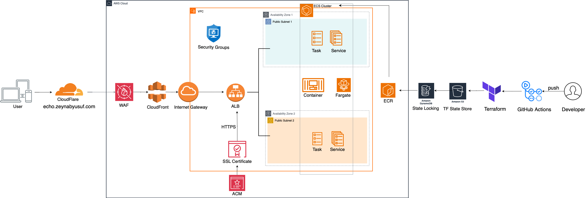

# Architectural Diagram

This architectural diagram provides an overview of our app's infrastructure, illustrating how the key components work together to deploy our Quran app for our users.

| Component                | Description                                                                                         |
|--------------------------|-----------------------------------------------------------------------------------------------------|
| **User**                 | The end-user accessing the application via a web browser. Traffic is routed through Cloudflare, ALB, and secured with WAF and ACM. |
| **Cloudflare**           | A DNS and security service that routes traffic to our app using a custom domain.                   |
| **Web Application Firewall (WAF)** | Adds protection by filtering unwanted requests before they reach our app.                 |
| **AWS Certificate Manager (ACM)** | Manages SSL/TLS certificates to enable HTTPS for secure traffic to our app.               |
| **Application Load Balancer (ALB)** | Distributes incoming traffic across ECS tasks in multiple availability zones for high availability. |
| **Internet Gateway**     | Allows internet access to resources in the public subnets of the VPC, such as the ALB.              |
| **Virtual Private Cloud (VPC)** | A private, isolated network on AWS where resources like ECS and ALB reside.                |
| **Public Subnets**       | Subnets within the VPC with routes to the internet, hosting resources like ALB to allow external access. |
| **Availability Zones (AZs)** | Isolated locations within a region to provide fault tolerance and high availability.          |
| **Elastic Container Service (ECS)**  | A container orchestration service that runs and manages our Docker containers.         |
| **ECS Cluster**          | A logical grouping of ECS resources to manage and deploy container tasks.                           |
| **Fargate**              | A serverless compute engine for ECS that allows us to run containers without managing servers.     |
| **Elastic Container Registry (ECR)** | AWS service for storing and managing Docker container images. Used to host our app’s container image. |
| **Secrets Manager**      | Securely stores sensitive information (e.g., API keys, database credentials) for use by our app.   |
| **Security Groups**      | Virtual firewalls controlling inbound and outbound traffic for components like ALB and ECS tasks.  |
| **GitHub Actions**       | CI/CD tool that automates our workflow i.e. building and deploying our app to ECS.                |
| **Terraform**            | Infrastructure as Code tool used to provision and manage AWS resources, like ECS and ALB, in a reproducible way. |
